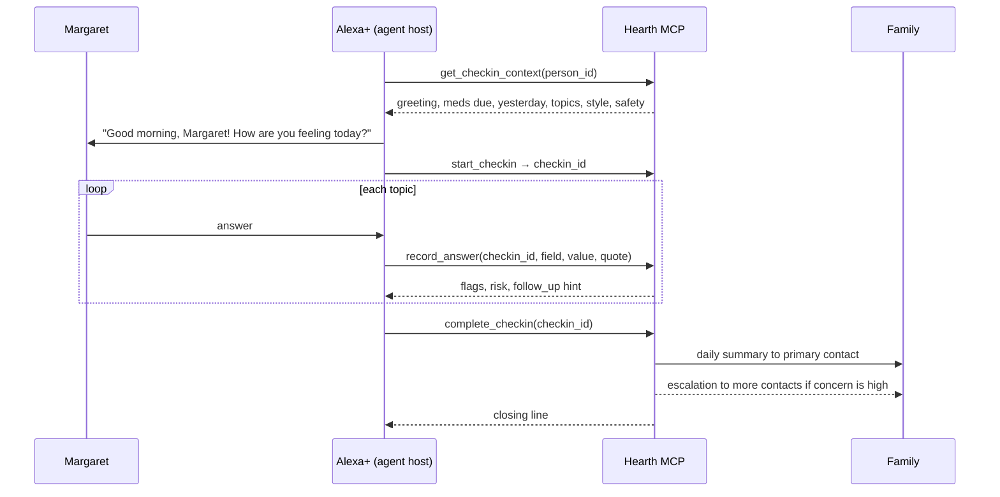

# Hearth

**A daily voice check-in for someone living alone, with the family kept in the loop.**

Hearth is an MCP server for agentic voice assistants such as Alexa+. Each morning the assistant has a short, warm conversation with the person: how they feel, how they slept, whether they took their medication, whether they've eaten, anything bothering them, plans for the day. Hearth records what they say, scores how worried a caregiver should be, sends the family a one-paragraph summary, and escalates on its own if the check-in never happens or something alarming comes up.

Amazon built a version of this idea (Alexa Together) and shut it down in 2023. Apps that do a daily "tap to say I'm OK" exist. What didn't exist is the agentic version: an actual conversation that adapts, notices "I fell getting to the bathroom," asks the follow-up a daughter would ask, and tells the family in plain words.

## What's in the box

| Piece | Path | What it does |
|---|---|---|
| MCP server | `hearth/mcp_server.py` | Nine tools, one resource, one prompt, served over Streamable HTTP (MCP spec 2025-11-25) at `/mcp` |
| Agent Skill | `skill/SKILL.md` | The conversation playbook for an agent host: order, tone, safety boundaries, escalation |
| Escalation watchdog | `hearth/escalation.py` | Window closes → nudge · +30 min → primary contact · +90 min → everyone, with last known status |
| Caregiver dashboard | `web/index.html` at `/` | Today's status, 14-day timeline with the actual words, alerts to acknowledge, contacts, window settings |
| Alexa+ simulator | `web/sim.html` at `/sim` | Stands in for the device; runs the same tools; shows every MCP call live. Speech in and out via the browser |
| Tests | `tests/` | Flag detection with negation, full check-in flow, help path, ladder timing, snooze, scripted host |

## Quick start

```bash
pip install -r requirements.txt
python -m hearth            # http://127.0.0.1:8787
```

The first run seeds a demo household: Margaret, 79, Columbus, two medications, daughter Anna as primary contact, a neighbor and a son behind her, and two weeks of history.

- Dashboard: http://127.0.0.1:8787/
- Simulator: http://127.0.0.1:8787/sim — press **Start morning check-in** and answer as Margaret. Try "I fell getting to the bathroom", "I forgot my pills", "call my daughter", "not now, later".
- MCP endpoint: `POST http://127.0.0.1:8787/mcp` (Streamable HTTP, stateless, JSON responses)

Run the tests with `python -m pytest -q tests`.

## How a check-in flows



If Margaret says "help" or describes an emergency at any point, the host calls `request_help` and every contact is alerted at once. If no check-in completes by the end of the window, the watchdog climbs the ladder without anyone asking.

## The MCP tools

| Tool | Purpose |
|---|---|
| `get_checkin_context(person_id)` | Everything the host needs before greeting: name, time of day, medications due, yesterday, topics, tone, safety rules |
| `start_checkin(person_id)` | Opens today's record; returns `checkin_id` |
| `record_answer(checkin_id, field, value, quote)` | Stores the interpreted answer and the exact words; returns detected flags, a 0-100 concern score, and a follow-up hint |
| `complete_checkin(checkin_id, summary?)` | Finalizes, sends the family summary, escalates if warranted, clears missed-check-in alerts |
| `request_help(person_id, reason, urgency)` | Immediate alert to every contact |
| `get_status(person_id)` | "How is Mom today?" for caregivers |
| `snooze_checkin(person_id, minutes)` | Pause the ladder; the person wants to talk later |
| `log_medication(person_id, medication, taken)` | Medication logged outside the check-in |
| `list_persons()` | People this instance looks after |

Resource `hearth://persons/{id}/today` and prompt `daily_checkin(person_id)` give a host the same context declaratively.

## Concern scoring, in the open

Hearth doesn't diagnose. It adds up things a family member would want to know: low mood or bad sleep, skipped medication, not eating, and words that matter. The word list is in `hearth/core.py` and is deliberately small and readable: a fall, chest pain, trouble breathing, dizziness, confusion, pain, loneliness, "help". Negations are handled ("I'm not hurt" doesn't flag). A score of 50 or more notifies the top two contacts; 80 or more notifies everyone. The person's exact words go into the summary so the family can judge for themselves.

## Notifications

Every message is written to the dashboard feed. Email (SMTP) and webhooks are wired and switched on by environment variables; SMS is a stub for a Twilio-compatible provider. Nothing leaves the machine unless configured.

| Variable | Purpose |
|---|---|
| `HEARTH_PORT`, `HEARTH_HOST` | Server bind (default 127.0.0.1:8787) |
| `HEARTH_DB` | SQLite path |
| `HEARTH_WATCHDOG_SECONDS` | Ladder evaluation interval (default 60) |
| `HEARTH_SMTP_HOST/PORT/USER/PASS/FROM` | Enable email to contacts with `channel=email` |
| `HEARTH_LLM_BASE_URL/API_KEY/MODEL` | Optional: run the simulator with a real LLM host over any OpenAI-compatible endpoint |

## Privacy and safety

- Runs locally. One SQLite file. No accounts, no cloud, no third-party calls unless you configure a channel.
- Hearth never gives medical advice. The skill tells the host to say so and to point to emergency services when needed.
- The person can decline. "Not now" snoozes; nobody is nagged. The family is told only what was said.
- This is a hackathon prototype, not a medical device or an emergency service.

## Status and roadmap

Built for the Amazon Developer Hackathon 2026, Alexa+ track. Working: everything above. Next: account linking so a device maps to a person, real device testing on Alexa+, SMS provider, multiple households per instance, weekly digest for the family, and a phone-call fallback when the device gets no answer.

## Disclosure

Designed and directed by James McC. The code, tests, and documentation were written with heavy use of an AI coding assistant (Claude), reviewed and tested locally. License: MIT.
