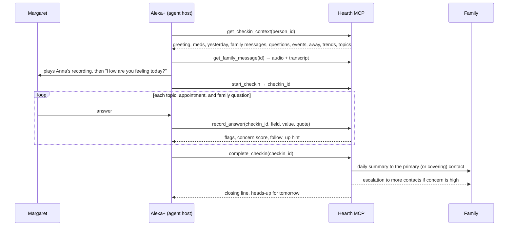

# Hearth

**A daily voice check-in for someone living alone, with the family kept in the loop.**

Hearth is an MCP server for agentic voice assistants such as Alexa+. Each morning the assistant has a short, warm conversation with the person: how they feel, how they slept, whether they took their medication, whether they've eaten, anything bothering them, today's appointments, questions the family asked, plans for the day. Hearth records what they say, scores how worried a caregiver should be, sends the family a one-paragraph summary, and escalates on its own if the check-in never happens or something alarming comes up.

Amazon built a version of this idea (Alexa Together) and shut it down in 2023. The "tap to say I'm OK" apps that remain are silent buttons. What didn't exist is the agentic version: an actual conversation that adapts, notices "I fell getting to the bathroom," asks the follow-up a daughter would ask, plays the daughter's own voice when she's away, and tells the family in plain words.

## What it does

- **The conversation.** Feeling, sleep, medication, food, worries, plans. One question at a time. Follow-ups when something needs one: a fall, dizziness, skipped pills, a low mood. Multi-fact answers are understood ("slept fine and took my pills with my toast" answers three questions). Unclear answers get a gentle choice. "Pardon?" repeats. "Not now" snoozes without nagging.
- **Family voice messages.** Anna records a message in the dashboard; it plays at the start of the next check-in, in her voice, then Hearth carries on. Schedule it for a date, or every morning while she's travelling. Margaret can say "tell Anna I love her" mid-conversation, or record a voice note, and it lands in the dashboard with a transcript.
- **Appointments and reminders.** Anyone can add them in the dashboard; Margaret can add them by voice ("I have the dentist on Friday at 10"). Hearth raises them on the day with the notes attached ("Tom is driving you, he'll be there at 1:30"), gives a heads-up the day before, and reports the response.
- **Questions from the family.** "Did the plumber come about the tap?" gets asked at the right moment and the answer comes back in the summary.
- **Away mode.** Mark a contact away with dates and a cover; the escalation ladder reroutes to the cover automatically and the check-in tells Margaret who her go-to is.
- **Escalation ladder.** Window closes → nudge and a watch alert · +30 min → primary contact · +90 min → everyone, with last known status. A completed check-in clears it.
- **Trend insights.** Two bad nights in a row, medication missed twice this week, mood sliding: said plainly in the summary and on the dashboard, computed from the last seven check-ins.
- **Caregiver queries.** "Alexa, how is Mom today?" and "What's on Mom's calendar?" answered from the same tools.

## What's in the box

| Piece | Path | What it does |
|---|---|---|
| MCP server | `hearth/mcp_server.py` | Fourteen tools, four resources, one prompt, served over Streamable HTTP (MCP spec 2025-11-25) at `/mcp`. Structured results; audio returned as MCP audio content |
| MCP App views | `hearth/ui.py` | Three `ui://` views (check-in card, calendar, family status) that any MCP Apps host renders on a screen: Echo Show, Claude, ChatGPT, VS Code. One HTML file each, a 40-line postMessage bridge, no SDK |
| Agent Skill | `skill/SKILL.md` | The conversation playbook for an agent host: order, tone, safety boundaries, escalation |
| Domain logic | `hearth/core.py` | Flags with negation handling, concern scoring, summaries, trends, away-aware contact routing, notifications |
| Escalation watchdog | `hearth/escalation.py` | Idempotent per-day ladder with an injectable clock |
| Caregiver dashboard | `web/index.html` at `/` | Status, 14-day timeline with the actual words, alerts, trends, calendar, voice messages, questions, contacts and away mode, window settings |
| Alexa+ simulator | `web/sim.html` at `/sim` | An Echo Show style device and the family's phone. Implements the host side of MCP Apps (sandboxed frames, `ui/initialize`, tool input and results, `ui/message`, `tools/call`), plays family audio, records voice notes, shows every MCP call live |
| Scripted host | `hearth/agent.py` | A deterministic host policy with light language handling so the demo needs no API key. Optional LLM host over any OpenAI-compatible endpoint |
| Tests | `tests/` | 19 tests: parsers, negation, fresh-per-day check-ins, context assembly, away routing, audio round-trip, events, ladder timing, snooze, the scripted host end to end, the MCP Apps surface over Streamable HTTP, the full OAuth flow |

## Quick start

```bash
pip install -r requirements.txt
python -m hearth            # http://127.0.0.1:8787
```

The first run seeds a demo household: Margaret, 79, Columbus, two medications, daughter Anna as primary contact (away this week, neighbor Tom covering), a son, two weeks of history, a message from Anna, a question she wants asked, a cardiology appointment today and a hair appointment tomorrow.

- Dashboard: http://127.0.0.1:8787/
- Simulator: http://127.0.0.1:8787/sim — press **Start morning check-in** and answer as Margaret. The device screen shows the check-in card ticking off as she answers; Anna's phone shows what the family gets. Try "I fell getting to the bathroom", "slept well and took my pills with my toast", "tell Anna I love her", "I have the dentist on Friday at 10", "call my daughter", "not now, later". **Reset demo** reseeds the household.
- MCP endpoint: `POST http://127.0.0.1:8787/mcp` (Streamable HTTP, stateless, JSON responses)

Run the tests with `python -m pytest -q tests`.

**Hands-free demo.** In the simulator, pick a host (the scripted one, or Claude / Nova on Bedrock when a key is configured) and press **▶ Run demo**. It reseeds the household, starts the check-in, and answers as Margaret in a second voice, matching her answers to whatever the host asks, so it works with a real model driving. A chapter banner above the device tells the story at each beat, then Anna asks her own device how Mom is. About two and a half minutes, which is what the hackathon video is. With `HEARTH_TTS=polly` the voices come from Amazon Polly through the AWS CLI (`HEARTH_AWS_CLI`, `HEARTH_AWS_PROFILE`, `HEARTH_AWS_REGION`), cached under the media folder; otherwise the browser's own voices are used, pickable next to the button. Drop a recording at `assets/demo/anna_message.mp3` and Anna's message plays in her voice.

## How a check-in flows



If Margaret says "help" or describes an emergency at any point, the host calls `request_help` and every active contact is alerted at once. If no check-in completes by the end of the window, the watchdog climbs the ladder without anyone asking.

## The MCP tools

| Tool | Purpose |
|---|---|
| `get_checkin_context(person_id)` | Everything the host needs before greeting: name, time of day, medications, yesterday, family messages, questions, today's and tomorrow's events, who is away, trend insights, topics, tone, safety rules |
| `get_family_message(message_id)` | The family's recording as MCP audio content plus the transcript |
| `mark_message_played(message_id)` | Don't repeat it (daily-repeat messages play again tomorrow) |
| `start_checkin(person_id)` | Opens today's record (a fresh one after a completed check-in; resumes an unfinished one) |
| `record_answer(checkin_id, field, value, quote)` | Stores the interpreted answer and the exact words; returns flags, a 0-100 concern score, and a follow-up hint. Fields include `question:<id>` and `event:<id>` |
| `complete_checkin(checkin_id, summary?)` | Finalizes, writes the family summary with answers, reminders and weekly insights, sends it, escalates if warranted, clears missed alerts |
| `request_help(person_id, reason, urgency)` | Immediate alert to every active contact |
| `record_reply(person_id, transcript, contact_name?, audio_base64?, mime?)` | A voice or text note from the person to a family member |
| `add_event(person_id, date, title, time?, kind?, notes?, added_by?, remind_day_before?)` | Appointment or reminder, by voice or dashboard |
| `list_events(person_id, days?)` | Upcoming calendar |
| `get_status(person_id)` | "How is Mom today?" for caregivers |
| `snooze_checkin(person_id, minutes)` | Pause the ladder; the person wants to talk later |
| `log_medication(person_id, medication, taken)` | Medication logged outside the check-in |
| `list_persons()` | People this instance looks after |

Resource `hearth://persons/{id}/today` and prompt `daily_checkin(person_id)` give a host the same context declaratively.

## On a screen: MCP App views

Alexa+ devices with screens, and hosts such as Claude, ChatGPT and VS Code, render **MCP Apps**: HTML views a server ships as `ui://` resources. Hearth ships three, in `hearth/ui.py`:

| View | Rendered for | Shows |
|---|---|---|
| `ui://hearth/checkin` | `get_checkin_context`, `start_checkin`, `record_answer`, `complete_checkin`, `get_family_message`, `request_help`, `snooze_checkin`, `record_reply`, `log_medication` | Greeting, the topics ticking off with the interpreted answers, flags in amber, medication, today's appointments, the family message with a play button, the outcome (summary sent, family alerted, paused) |
| `ui://hearth/calendar` | `list_events`, `add_event` | The next seven days; an event just added by voice is highlighted. Grid on a device, agenda list on a phone |
| `ui://hearth/status` | `get_status` | The caregiver's card: state, concern level, summary, open alerts, flags, the week's trends |

How it fits the spec (2026-01-26): each tool advertises its view in `_meta.ui.resourceUri`; the resources are served with mime type `text/html;profile=mcp-app` and `_meta.ui` rendering hints; the host renders the HTML in a sandboxed iframe and the two sides talk JSON-RPC over `postMessage`. A view sends `ui/initialize`, reads the host context it gets back (theme, container size, safe-area insets), announces `ui/notifications/initialized`, then receives `ui/notifications/tool-input` and `ui/notifications/tool-result` for the call that opened it. The check-in card also sends `ui/message` (the play button asks the host to replay the message) and reports `ui/notifications/size-changed`. Views size their type from the host's `containerDimensions`, never from the viewport, so they look right on an Echo Show, in a chat sidebar, or on a phone.

The simulator implements the host side, in about eighty lines of `web/sim.html`, so the demo exercises the same contract a real host would. Tool results carry `structuredContent`, which is what the views render from; the text block is the fallback.

## Concern scoring, in the open

Hearth doesn't diagnose. It adds up things a family member would want to know: low mood or bad sleep, skipped medication, not eating, and words that matter. The word list is in `hearth/core.py` and is deliberately small and readable: a fall, chest pain, trouble breathing, dizziness, confusion, pain, loneliness, "help". Negations are handled ("I'm not hurt" doesn't flag; "I did not fall" doesn't flag). A score of 50 or more notifies the top two contacts; 80 or more notifies everyone. The person's exact words go into the summary so the family can judge for themselves.

## Notifications

Every message is written to the dashboard feed. Email goes out through any SMTP relay; the demo household uses Amazon SES (a verified sender, SES SMTP credentials, port 587 with STARTTLS). Webhooks are wired too; SMS is a stub for a Twilio-compatible provider. Nothing leaves the machine unless configured.

| Variable | Purpose |
|---|---|
| `HEARTH_PORT`, `HEARTH_HOST` | Server bind (default 127.0.0.1:8787) |
| (any of these in a `.env` file) | `python -m hearth` reads `KEY=value` lines from `.env` in the working directory; the file is git-ignored |
| `HEARTH_DB`, `HEARTH_MEDIA` | SQLite path, audio folder |
| `HEARTH_WATCHDOG_SECONDS` | Ladder evaluation interval (default 60) |
| `HEARTH_SMTP_HOST/PORT/USER/PASS/FROM` | Enable email to contacts with `channel=email`. For Amazon SES: host `email-smtp.<region>.amazonaws.com`, port 587, the SMTP credentials from the SES console, a verified sender |
| `HEARTH_FAMILY_EMAIL` | Demo convenience: the seeded family contacts get this real inbox with `channel=email` |
| `HEARTH_TTS`, `HEARTH_AWS_CLI`, `HEARTH_AWS_PROFILE`, `HEARTH_AWS_REGION` | `HEARTH_TTS=polly` narrates the demo with Amazon Polly via the AWS CLI (e.g. `wsl.exe -d Ubuntu -- aws` on Windows); off by default |
| `HEARTH_LLM_BASE_URL/API_KEY/MODEL` | Optional: run the simulator with a real LLM host. Amazon Bedrock Converse API (Claude, Nova): base URL `https://bedrock-runtime.us-west-2.amazonaws.com`, a Bedrock API key, model `us.anthropic.claude-sonnet-4-6`. Or any OpenAI-compatible endpoint (Bedrock Mantle, Groq, OpenAI): base URL ending in `/v1`, model e.g. `openai.gpt-oss-120b` |
| `HEARTH_LLM_PROTOCOL` | `converse` (Bedrock Converse API) or `chat` (OpenAI chat completions). Inferred from the base URL when unset |
| `HEARTH_PUBLIC_URL` | Public HTTPS base URL. Setting it turns on OAuth for `/mcp` and the account-linking page |
| `HEARTH_OAUTH_CLIENT_ID/SECRET` | The fixed client Alexa+ uses (from the developer console) |
| `HEARTH_OAUTH_REDIRECT_URIS` | Comma-separated Alexa account-linking redirect URIs; any Amazon `/api/skill/link/` URI is also accepted |

## Privacy and safety

- Runs locally. One SQLite file and a folder of recordings. No accounts, no cloud, no third-party calls unless you configure a channel.
- Hearth never gives medical advice. The skill tells the host to say so and to point to emergency services when needed.
- The person can decline. "Not now" snoozes; nobody is nagged. The family is told only what was said.
- Recordings are real voices, never synthesized imitations.
- This is a hackathon prototype, not a medical device or an emergency service.

## Connecting to Alexa+ (the real thing)

Amazon's [Alexa+ MCP Toolkit](https://developer.amazon.com/docs/alexaplus/add-ons/mcp-toolkit-overview.html) connects a Streamable HTTP MCP server to Alexa+ as an add-on, testable in Amazon's web simulator at the development stage. Hearth meets the toolkit's checklist:

- **Streamable HTTP, spec 2025-11-25**, stateless, JSON responses, under 500 ms per tool.
- **OAuth 2.1, two tiers, as Alexa+ requires.** Service tier: `client_credentials` with HTTP Basic client auth, scope `mcp:service`, `resource` parameter validated against the server's canonical URI, 3600 s tokens, no refresh. User tier: `authorization_code` with PKCE S256, scopes `mcp:tools mcp:resources`, refresh tokens with rotation. Fixed client id and secret from the console; no dynamic client registration. Metadata at `/.well-known/oauth-authorization-server` and `/.well-known/oauth-protected-resource`.
- **Account linking is the consent page.** The customer lands on `/link`, says whose home the device is in, and every token from then on carries that person. Tools called with `person_id=0` resolve to the linked person; a service token can discover tools but cannot act for anyone.
- **Store assets** in `assets/`: light and dark icons in the six required sizes, carousel and banner images. Privacy policy and terms in `PRIVACY.md` and `TERMS.md`.

To run it publicly:

```bash
# 1. expose the server (any HTTPS tunnel; cloudflared needs no account)
cloudflared tunnel --url http://127.0.0.1:8787

# 2. start Hearth with the public URL and the client credentials from the Alexa developer console
set HEARTH_PUBLIC_URL=https://<your-tunnel>.trycloudflare.com
set HEARTH_OAUTH_CLIENT_ID=<from console>
set HEARTH_OAUTH_CLIENT_SECRET=<from console>
set HEARTH_OAUTH_REDIRECT_URIS=https://alexa.amazon.com/api/skill/link/<id>,https://pitangui.amazon.com/api/skill/link/<id>,https://layla.amazon.com/api/skill/link/<id>
python -m hearth

# 3. create and deploy the add-on with the Alexa AI CLI, then open the web simulator
alexa-ai new mcp --name "Hearth" --locale en-US --mcp-server-url "$HEARTH_PUBLIC_URL/mcp"
alexa-ai configure-account-linking
alexa-ai deploy
```

The Alexa AI CLI needs Node 24 on macOS or Ubuntu (WSL works), an Amazon developer account, and an AWS account for its private npm registry. `tests/oauth_flow_check.py` exercises the exact flow the toolkit uses, end to end, without any of that.

**Where this stands, honestly.** As of September 2026 the MCP Toolkit is a private preview: Amazon's builder page says it is "available to select partners working directly with our team", the CLI's registry only admits allow-listed AWS accounts, and the hackathon organizers confirmed that participants have no way to call Alexa+ during the contest. So the simulator is the demo surface, and everything above is built to the published requirements so that switching to the real host is configuration, not code.

## Certification self-check

Amazon's Local Inspector, which grades an add-on against the published [functional requirements](https://developer.amazon.com/docs/alexaplus/add-ons/functional-requirements.html), is part of the private preview. `tests/certification_check.py` does the same job from the outside: it walks the real Streamable HTTP endpoint, invokes every tool in a realistic order and times it, checks schemas, error shapes, stable identifiers, fresh-start continuity, the MCP App views, the store metadata in `addon/manifest.json`, and the two-tier OAuth flow. It writes `certification-verdict.json`, the same kind of artifact the inspector produces.

```bash
python tests/certification_check.py     # READY: 22 pass, 0 warn, 0 fail
```

**Scenario suite.** `tests/scenarios.py` runs twelve different Margarets through the host, cooperative, chatty, vague, low and lonely, refusing, forgetting her pills, dizzy and unfed, mentioning a fall, sending Anna a message, adding an appointment, chest tightness, fallen and unable to get up, and checks what was recorded, which flags fired, the concern level, and who was alerted. `--host scripted` is free and deterministic (12/12); `--host llm` runs the same personas through the configured Bedrock model and writes `scenario-results-llm.json`, transcripts included. Claude Sonnet 4.6 on Bedrock: 12/12, with both emergencies escalated on the first turn and the refusal snoozed without a nag.

`addon/manifest.json` holds the store listing: name, plain-language description, example phrases, prerequisites, privacy and terms URLs, icons in every required size, and the MCP and account-linking endpoints.

## Status and roadmap

Built for the Amazon Developer Hackathon 2026, Alexa+ track. Working: everything above, including account linking and the on-screen views. Next: real device testing when the Alexa+ toolkit opens up, an LLM host on Amazon Bedrock, email and SMS through AWS, multiple households per instance, a weekly family digest, and a phone-call fallback when the device gets no answer.

## Disclosure

Designed and directed by James McC. The code, tests, and documentation were written with heavy use of an AI coding assistant (Claude), reviewed and tested locally. License: MIT.
