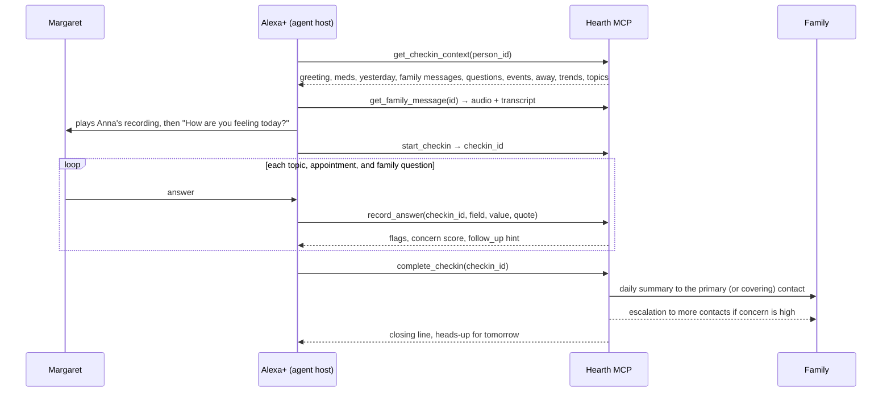

# Hearth

**A daily voice check-in for someone living alone, with the family kept in the loop.**

Hearth is an MCP server for agentic voice assistants such as Alexa+. Each morning the assistant has a short, warm conversation with the person: how they feel, how they slept, whether they took their medication, whether they've eaten, anything bothering them, today's appointments, questions the family asked, plans for the day. Hearth records what they say, scores how worried a caregiver should be, sends the family a one-paragraph summary, and escalates on its own if the check-in never happens or something alarming comes up.

Amazon built a version of this idea (Alexa Together) and shut it down in 2023. The "tap to say I'm OK" apps that remain are silent buttons. What didn't exist is the agentic version: an actual conversation that adapts, notices "I fell getting to the bathroom," asks the follow-up a daughter would ask, plays the daughter's own voice when she's away, and tells the family in plain words.

## What it does

- **The conversation.** Feeling, sleep, medication, food, worries, plans. One question at a time. Follow-ups when something needs one: a fall, dizziness, skipped pills, a low mood. Multi-fact answers are understood ("slept fine and took my pills with my toast" answers three questions). Unclear answers get a gentle choice. "Pardon?" repeats. "Not now" snoozes without nagging.
- **Family voice messages.** Anna records a message in the dashboard; it plays at the start of the next check-in, in her voice, then Hearth carries on. Schedule it for a date, or every morning while she's travelling. Margaret can say "tell Anna I love her" mid-conversation, or record a voice note, and it lands in the dashboard with a transcript.
- **Appointments and reminders.** Anyone can add them in the dashboard; Margaret can add them by voice ("I have the dentist on Friday at 10"). Hearth raises them on the day with the notes attached ("Tom is driving you, he'll be there at 1:30"), gives a heads-up the day before, and reports the response.
- **Questions from the family.** "Did the plumber come about the tap?" gets asked at the right moment and the answer comes back in the summary.
- **Away mode.** Mark a contact away with dates and a cover; the escalation ladder reroutes to the cover automatically and the check-in tells Margaret who her go-to is.
- **Escalation ladder.** Window closes → nudge and a watch alert · +30 min → primary contact · +90 min → everyone, with last known status. A completed check-in clears it.
- **Trend insights.** Two bad nights in a row, medication missed twice this week, mood sliding: said plainly in the summary and on the dashboard, computed from the last seven check-ins.
- **Caregiver queries.** "Alexa, how is Mom today?" and "What's on Mom's calendar?" answered from the same tools.

## What's in the box

| Piece | Path | What it does |
|---|---|---|
| MCP server | `hearth/mcp_server.py` | Fourteen tools, one resource, one prompt, served over Streamable HTTP (MCP spec 2025-11-25) at `/mcp`. Audio is returned as MCP audio content |
| Agent Skill | `skill/SKILL.md` | The conversation playbook for an agent host: order, tone, safety boundaries, escalation |
| Domain logic | `hearth/core.py` | Flags with negation handling, concern scoring, summaries, trends, away-aware contact routing, notifications |
| Escalation watchdog | `hearth/escalation.py` | Idempotent per-day ladder with an injectable clock |
| Caregiver dashboard | `web/index.html` at `/` | Status, 14-day timeline with the actual words, alerts, trends, calendar, voice messages, questions, contacts and away mode, window settings |
| Alexa+ simulator | `web/sim.html` at `/sim` | Stands in for the device; runs the same tools; plays family audio; records voice notes; shows every MCP call live |
| Scripted host | `hearth/agent.py` | A deterministic host policy with light language handling so the demo needs no API key. Optional LLM host over any OpenAI-compatible endpoint |
| Tests | `tests/` | 15 tests: parsers, negation, fresh-per-day check-ins, context assembly, away routing, audio round-trip, events, ladder timing, snooze, the scripted host end to end |

## Quick start

```bash
pip install -r requirements.txt
python -m hearth            # http://127.0.0.1:8787
```

The first run seeds a demo household: Margaret, 79, Columbus, two medications, daughter Anna as primary contact (away this week, neighbor Tom covering), a son, two weeks of history, a message from Anna, a question she wants asked, a cardiology appointment today and a hair appointment tomorrow.

- Dashboard: http://127.0.0.1:8787/
- Simulator: http://127.0.0.1:8787/sim — press **Start morning check-in** and answer as Margaret. Try "I fell getting to the bathroom", "slept well and took my pills with my toast", "tell Anna I love her", "I have the dentist on Friday at 10", "call my daughter", "not now, later".
- MCP endpoint: `POST http://127.0.0.1:8787/mcp` (Streamable HTTP, stateless, JSON responses)

Run the tests with `python -m pytest -q tests`.

## How a check-in flows



If Margaret says "help" or describes an emergency at any point, the host calls `request_help` and every active contact is alerted at once. If no check-in completes by the end of the window, the watchdog climbs the ladder without anyone asking.

## The MCP tools

| Tool | Purpose |
|---|---|
| `get_checkin_context(person_id)` | Everything the host needs before greeting: name, time of day, medications, yesterday, family messages, questions, today's and tomorrow's events, who is away, trend insights, topics, tone, safety rules |
| `get_family_message(message_id)` | The family's recording as MCP audio content plus the transcript |
| `mark_message_played(message_id)` | Don't repeat it (daily-repeat messages play again tomorrow) |
| `start_checkin(person_id)` | Opens today's record (a fresh one after a completed check-in; resumes an unfinished one) |
| `record_answer(checkin_id, field, value, quote)` | Stores the interpreted answer and the exact words; returns flags, a 0-100 concern score, and a follow-up hint. Fields include `question:<id>` and `event:<id>` |
| `complete_checkin(checkin_id, summary?)` | Finalizes, writes the family summary with answers, reminders and weekly insights, sends it, escalates if warranted, clears missed alerts |
| `request_help(person_id, reason, urgency)` | Immediate alert to every active contact |
| `record_reply(person_id, transcript, contact_name?, audio_base64?, mime?)` | A voice or text note from the person to a family member |
| `add_event(person_id, date, title, time?, kind?, notes?, added_by?, remind_day_before?)` | Appointment or reminder, by voice or dashboard |
| `list_events(person_id, days?)` | Upcoming calendar |
| `get_status(person_id)` | "How is Mom today?" for caregivers |
| `snooze_checkin(person_id, minutes)` | Pause the ladder; the person wants to talk later |
| `log_medication(person_id, medication, taken)` | Medication logged outside the check-in |
| `list_persons()` | People this instance looks after |

Resource `hearth://persons/{id}/today` and prompt `daily_checkin(person_id)` give a host the same context declaratively.

## Concern scoring, in the open

Hearth doesn't diagnose. It adds up things a family member would want to know: low mood or bad sleep, skipped medication, not eating, and words that matter. The word list is in `hearth/core.py` and is deliberately small and readable: a fall, chest pain, trouble breathing, dizziness, confusion, pain, loneliness, "help". Negations are handled ("I'm not hurt" doesn't flag; "I did not fall" doesn't flag). A score of 50 or more notifies the top two contacts; 80 or more notifies everyone. The person's exact words go into the summary so the family can judge for themselves.

## Notifications

Every message is written to the dashboard feed. Email (SMTP) and webhooks are wired and switched on by environment variables; SMS is a stub for a Twilio-compatible provider. Nothing leaves the machine unless configured.

| Variable | Purpose |
|---|---|
| `HEARTH_PORT`, `HEARTH_HOST` | Server bind (default 127.0.0.1:8787) |
| `HEARTH_DB`, `HEARTH_MEDIA` | SQLite path, audio folder |
| `HEARTH_WATCHDOG_SECONDS` | Ladder evaluation interval (default 60) |
| `HEARTH_SMTP_HOST/PORT/USER/PASS/FROM` | Enable email to contacts with `channel=email` |
| `HEARTH_LLM_BASE_URL/API_KEY/MODEL` | Optional: run the simulator with a real LLM host over any OpenAI-compatible endpoint |

## Privacy and safety

- Runs locally. One SQLite file and a folder of recordings. No accounts, no cloud, no third-party calls unless you configure a channel.
- Hearth never gives medical advice. The skill tells the host to say so and to point to emergency services when needed.
- The person can decline. "Not now" snoozes; nobody is nagged. The family is told only what was said.
- Recordings are real voices, never synthesized imitations.
- This is a hackathon prototype, not a medical device or an emergency service.

## Status and roadmap

Built for the Amazon Developer Hackathon 2026, Alexa+ track. Working: everything above. Next: account linking so a device maps to a person, real device testing on Alexa+, an SMS provider, multiple households per instance, a weekly family digest, and a phone-call fallback when the device gets no answer.

## Disclosure

Designed and directed by James McC. The code, tests, and documentation were written with heavy use of an AI coding assistant (Claude), reviewed and tested locally. License: MIT.
